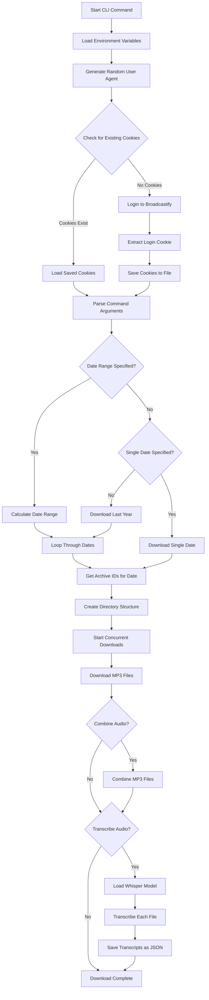

# broadcastify-cli

A powerful command-line tool for downloading and processing Broadcastify archives. This tool requires a Broadcastify.com premium subscription and provides features for downloading, combining, and transcribing police scanner audio files.

## Features

- **Archive Download**: Download police scanner archives by feed ID and date
- **Date Range Support**: Download archives across multiple dates
- **Concurrent Downloads**: Multi-threaded downloading for faster performance
- **Audio Combination**: Combine multiple MP3 files into a single file
- **Audio Transcription**: Transcribe audio files using Whisper AI
- **Session Management**: Automatic login and cookie management
- **Rich Progress Tracking**: Beautiful console output with progress bars

## Installation

### Option 1: Install from PyPI
```bash
pip install broadcastify-cli
```

### Option 2: Install from Source
```bash
git clone https://github.com/NotJoeMartinez/broadcastify-cli
cd broadcastify-cli
python3 -m venv .venv
source .venv/bin/activate  # On Windows: .venv\Scripts\activate
pip install -r requirements.txt
pip install -e .
```

## Configuration

Create a `.env` file in your project directory with your Broadcastify credentials:

```env
USERNAME="your_username"
PASSWORD="your_password"
```

**Note**: You need a premium subscription to access Broadcastify archives.

## How It Works

The scraper follows this workflow to download and process archives:



## Usage

### Basic Commands

#### Download Archives for a Specific Date
```bash
broadcastify-cli download --feed-id 5318 --date 04/17/2024
```

#### Download Archives for a Date Range
```bash
broadcastify-cli download --feed-id 5318 --range 04/17/2024-04/20/2024
```

#### Download All Available Archives (Last Year)
```bash
broadcastify-cli download --feed-id 5318
```

### Advanced Options

#### Download with Audio Combination
Combine all downloaded MP3 files into a single file:
```bash
broadcastify-cli download --feed-id 5318 --date 04/17/2024 --combine
```

#### Download with Transcription
Transcribe all downloaded audio files using Whisper AI:
```bash
broadcastify-cli download --feed-id 5318 --date 04/17/2024 --transcribe
```

#### Use Multiple Concurrent Downloads
Speed up downloads by using multiple threads:
```bash
broadcastify-cli download --feed-id 5318 --date 04/17/2024 --jobs 4
```

#### Combine All Features
```bash
broadcastify-cli download --feed-id 5318 --date 04/17/2024 --combine --transcribe --jobs 4
```

### Transcribe Existing Audio Files
If you already have audio files, you can transcribe them separately:
```bash
broadcastify-cli transcribe --directory archives/5318/04172024
```

## Command Line Options

### Download Command
- `--feed-id, -id`: Broadcastify feed ID (required)
- `--date, -d`: Specific date in MM/DD/YYYY format
- `--range, -r`: Date range in MM/DD/YYYY-MM/DD/YYYY format
- `--combine`: Combine downloaded MP3 files into a single file
- `--transcribe, -t`: Transcribe downloaded MP3 files using Whisper AI
- `--jobs, -j`: Number of concurrent download jobs (default: 1)

### Transcribe Command
- `--directory, -d`: Directory containing audio files to transcribe (required)

## Output Structure

The tool creates a well-organized directory structure:

```
archives/
└── 5318/                    # Feed ID
    └── 04172024/           # Date (MMDDYYYY)
        ├── 202404170021-373175-5318.mp3
        ├── 202404170050-396916-5318.mp3
        ├── 202404170120-465838-5318.mp3
        ├── combined_5318_04172024.mp3    # If --combine used
        └── transcripts/                  # If --transcribe used
            ├── 202404170021-373175-5318.json
            ├── 202404170050-396916-5318.json
            └── 202404170120-465838-5318.json
```

## Finding Feed IDs

To find a feed ID, visit the Broadcastify feed page and extract the ID from the URL:

```
URL: https://www.broadcastify.com/archives/feed/5318
Feed ID: 5318
```

## Examples

### Example 1: Download Dallas City Police Archives
```bash
# Download all archives from April 17, 2024
broadcastify-cli download --feed-id 5318 --date 04/17/2024

# Download with transcription and combination
broadcastify-cli download --feed-id 5318 --date 04/17/2024 --combine --transcribe
```

### Example 2: Download Multiple Days
```bash
# Download a week of archives
broadcastify-cli download --feed-id 5318 --range 04/17/2024-04/23/2024 --jobs 4
```

### Example 3: Download All Available Archives
```bash
# Download the last year of archives (use with caution - large download)
broadcastify-cli download --feed-id 5318 --jobs 8
```

## Technical Details

### Authentication
- Uses session-based authentication with cookies
- Automatically handles login and cookie management
- Saves cookies to `cookies.json` for reuse

### Download Process
- Fetches archive IDs via AJAX endpoint
- Downloads MP3 files with proper headers and authentication
- Supports concurrent downloads for improved performance
- Creates organized directory structure automatically

### Transcription
- Uses Faster Whisper (large-v3 model) for transcription
- Optimized for police scanner audio with custom prompts
- Outputs structured JSON with timestamps and segments
- Supports CPU and GPU acceleration

### Audio Processing
- Uses pydub for audio manipulation
- Combines MP3 files in chronological order
- Maintains audio quality during combination

## Dependencies

Key dependencies include:
- `requests`: HTTP client for API calls
- `faster-whisper`: AI transcription engine
- `pydub`: Audio file processing
- `rich`: Beautiful console output
- `click`: Command-line interface
- `python-dotenv`: Environment variable management

## Troubleshooting

### Common Issues

1. **Authentication Failed**
   - Verify your credentials in `.env` file
   - Ensure you have a premium subscription
   - Delete `cookies.json` and try again

2. **No Archives Found**
   - Check if the feed ID is correct
   - Verify the date format (MM/DD/YYYY)
   - Some feeds may not have archives for certain dates

3. **Download Failures**
   - Check your internet connection
   - Try reducing the number of concurrent jobs
   - Verify your premium subscription is active

4. **Transcription Issues**
   - Ensure sufficient disk space for Whisper model
   - Consider using GPU if available for faster transcription
   - Check audio file integrity

### Performance Tips

- Use `--jobs` to increase download speed (4-8 jobs recommended)
- For large downloads, consider downloading in smaller date ranges
- Transcription is CPU-intensive; use GPU if available
- Monitor disk space for large archive downloads

## License

This project is licensed under the MIT License - see the LICENSE file for details.

## Contributing

Contributions are welcome! Please feel free to submit a Pull Request.
